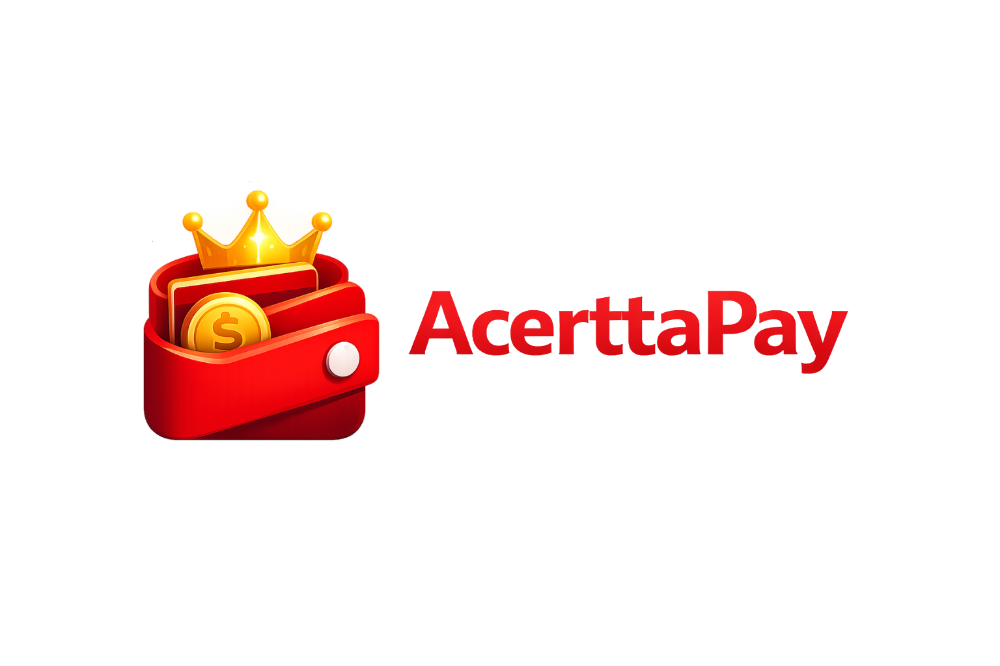

<div align="center">
  
  <h1>💳 OrganizaPay</h1>
  <p><strong>Seu cantinho financeiro para cartões, competências mensais, contas compartilhadas e cobranças entre amigos.</strong></p>
  <p>
    Um app web/PWA pensado para a vida real: importa fatura, organiza mês, divide gastos por pessoa,
    acompanha cobranças compartilhadas e ainda cabe direitinho no bolso — ou no desktop.
  </p>
  <p>
    
    
    
    
    
    
    
  </p>
</div>

---

## ✨ Visão rápida

O **OrganizaPay** é uma aplicação web com experiência de **PWA** focada em controle financeiro com ênfase em:

- **cartões de crédito** com vencimento e fechamento;
- **competência mensal** como regra de organização;
- **lançamentos à vista, parcelados e recorrentes**;
- **rateio por pessoa** com divisão igual ou valor definido;
- **cobranças compartilhadas** entre usuários do sistema;
- **compartilhamento de resumos** e automações de comunicação;
- **central administrativa** para Google, WhatsApp, push, segurança, backup e mais.

> Em bom português: ele ajuda a organizar a vida financeira sem transformar cartão, amizade e planilha numa novela das 9.

---

## 🧭 Navegação rápida

- [📌 O que o app resolve](#o-que-o-app-resolve)
- [🧩 Funcionalidades](#funcionalidades-principais)
- [🧠 Diferenciais](#diferenciais-do-produto)
- [🏗️ Stack](#stack)
- [🗂️ Estrutura do projeto](#estrutura-do-projeto)
- [🚀 Como rodar localmente](#como-rodar-localmente)
- [⚙️ Variáveis de ambiente](#variaveis-de-ambiente)
- [👑 Primeiro acesso e admin](#primeiro-acesso-e-admin)
- [🛠️ Central Admin](#central-admin)
- [📱 PWA e offline](#pwa-e-offline)
- [🧭 Rotas principais](#rotas-principais)
- [📦 Deploy](#deploy)
- [🛡️ Boas práticas de segurança](#boas-praticas-de-seguranca)
- [📄 Licença](#licenca)

---

<a id="o-que-o-app-resolve"></a>
## 📌 O que o app resolve

O OrganizaPay nasceu para lidar com situações que aplicativos genéricos normalmente tratam mal:

- compras que caem em **competências diferentes** por causa do fechamento do cartão;
- gastos que precisam ser **divididos entre 2, 3 ou 20 pessoas**;
- parcelas que precisam manter **histórico e rastreabilidade**;
- cobranças entre amigos sem perder o contexto de quem pagou, quem confirmou e o que ainda está pendente;
- necessidade de usar o sistema tanto no **mobile/PWA** quanto no **desktop**;
- administração centralizada de integrações e da “memória do app”, incluindo **backup e restauração**.

---

<a id="funcionalidades-principais"></a>
## 🧩 Funcionalidades principais

### 💳 Cartões e competência mensal
- cadastro de cartões com vencimento, fechamento e status ativo/inativo;
- cálculo orientado por **competência**, não só por data bruta de compra;
- visão mensal para conferência e ajustes em lote.

### 🧾 Lançamentos flexíveis
- importação de fatura por **CSV**;
- lançamento manual à vista;
- compras parceladas com vínculo entre parcelas;
- recorrências mensais com controle de exceções.

### 👥 Rateio por pessoa
- distribuição de um gasto entre uma ou várias pessoas;
- **divisão em partes iguais**;
- **divisão por valor definido**;
- edição individual e também em fluxo de lote na visão mensal.

### 🤝 Cobranças entre amigos
- solicitação automática ou manual de cobrança compartilhada;
- resposta, contestação, aceite, marcação de pagamento e confirmação de recebimento;
- histórico completo por solicitação;
- notificações in-app e push para não deixar pendência virar mistério.

### 📤 Compartilhamento e comunicação
- página de compartilhamento por pessoa;
- uso de **Web Share API** quando disponível;
- fallback para download da imagem;
- automação opcional de envio via **WhatsApp / Evolution API** para administradores.

### 🛠️ Central administrativa
A rota `/admin` concentra as configurações do sistema em uma central organizada por assunto:

- **Login com Google**;
- **WhatsApp automático**;
- **alertas e push**;
- **sessão e segurança**;
- **cobranças entre amigos**;
- **backup e restauração**;
- **ajustes estruturais do sistema**.

### ☁️ Backup e restauração
- backup manual e programado;
- retenção configurável;
- cópia em mais de um local do servidor;
- upload opcional para Google Drive;
- restauração a partir de pacote `.zip` gerado pelo próprio app.

---

<a id="diferenciais-do-produto"></a>
## 🧠 Diferenciais do produto

- **Foco em competência mensal**: o mês financeiro manda na experiência.
- **Histórico preservado**: o sistema prefere proteger rastreabilidade a “sumir com o passado”.
- **Experiência híbrida**: funciona bem no celular, no navegador e como PWA instalável.
- **Operação real do dia a dia**: feito para uso contínuo, não só para demo bonita.
- **Tom humano**: o produto conversa de forma leve sem perder clareza.

---

<a id="stack"></a>
## 🏗️ Stack

### Backend
- **Node.js**
- **Express**
- **Express Session**
- **Passport + Google OAuth 2.0**

### Frontend
- **EJS**
- HTML/CSS/JS vanilla
- **html2canvas** para geração visual de compartilhamento

### Dados e processamento
- **SQLite** com `better-sqlite3`
- importação com `csv-parse`
- tratamento de datas com `dayjs`
- regras de vencimento úteis com `date-holidays`

### Comunicação e app shell
- **Web Push** com `web-push`
- **PWA** com `manifest.json` + `service worker`
- integração opcional com **Evolution API** para WhatsApp

---

<a id="estrutura-do-projeto"></a>
## 🗂️ Estrutura do projeto

```text
.
├── public/                     # CSS, JS do cliente, ícones, manifest, service worker e docs públicos
│   ├── docs/                   # guias em PDF da central administrativa
│   └── offline.html            # fallback amigável para modo offline
├── scripts/                    # migrações e seed
├── src/
│   ├── appConfig.js            # definições da central de configuração
│   ├── backupEngine.js         # rotinas de backup e restauração
│   ├── db.js                   # conexão SQLite
│   ├── dueDate.js              # cálculo de vencimento útil
│   └── utils.js                # utilitários gerais
├── views/                      # páginas EJS
├── data/                       # banco SQLite local e arquivos auxiliares
├── server.js                   # aplicação principal
├── .env.example                # bootstrap inicial de variáveis
├── ecosystem.config.js         # deploy com PM2
├── generate-vapid.js           # geração de chaves push
└── README.md                   # este arquivo bonitão aqui
```

---

<a id="como-rodar-localmente"></a>
## 🚀 Como rodar localmente

### Pré-requisitos
- Node.js
- npm
- credenciais do Google OAuth 2.0

### Instalação

```bash
npm install
cp .env.example .env
npm run migrate
npm start
```

A aplicação sobe por padrão em:

```text
http://localhost:3001
```

### Primeira instalação
Em uma instalação nova, o fluxo mais seguro é:

1. preparar o `.env` com o básico;
2. rodar as migrações;
3. subir o servidor;
4. acessar `/setup` ou preparar o primeiro usuário administrador no banco;
5. finalizar o restante das configurações pela rota `/admin`.

---

<a id="variaveis-de-ambiente"></a>
## ⚙️ Variáveis de ambiente

O `.env.example` já traz o ponto de partida. Os blocos mais importantes são:

```env
PORT=3001
SESSION_SECRET=uma_chave_longa_e_aleatoria

GOOGLE_CLIENT_ID=...
GOOGLE_CLIENT_SECRET=...
GOOGLE_CALLBACK_URL=http://localhost:3001/auth/google/callback

EVOLUTION_API_URL=https://sua-instancia.com
EVOLUTION_API_KEY=sua-chave
EVOLUTION_INSTANCE_NAME=sua-instancia

VAPID_PUBLIC_KEY=...
VAPID_PRIVATE_KEY=...
VAPID_SUBJECT=mailto:voce@dominio.com

INACTIVITY_TIMEOUT_MINUTES=0

CARD_DUE_PUSH_TIMEZONE=America/Sao_Paulo
CARD_DUE_PUSH_HOUR=10
CARD_DUE_PUSH_MINUTE=0
CARD_DUE_PUSH_CHECK_INTERVAL_MINUTES=10

CARD_DUE_PUSH_ENABLED=1
CARD_DUE_PUSH_MAX_SENDS_PER_DAY=1
CARD_DUE_PUSH_REPEAT_INTERVAL_MINUTES=0
MONTHLY_FINANCE_DATE_ALERT_ENABLED=1
DATE_DRIVEN_ALERTS_ENABLED=1
```

<details>
  <summary><strong>O que cada bloco faz</strong></summary>

- `SESSION_SECRET` → protege a sessão do usuário;
- `GOOGLE_*` → autenticação com Google;
- `EVOLUTION_*` → integração de WhatsApp para automações administrativas;
- `VAPID_*` → infraestrutura do push web;
- `INACTIVITY_TIMEOUT_MINUTES` → expiração da sessão por inatividade;
- `CARD_DUE_PUSH_TIMEZONE`, `CARD_DUE_PUSH_HOUR`, `CARD_DUE_PUSH_MINUTE` e `CARD_DUE_PUSH_CHECK_INTERVAL_MINUTES` → agenda compartilhada das rotinas automáticas;
- `CARD_DUE_PUSH_ENABLED`, `CARD_DUE_PUSH_MAX_SENDS_PER_DAY` e `CARD_DUE_PUSH_REPEAT_INTERVAL_MINUTES` → rotina de vencimento da fatura;
- `MONTHLY_FINANCE_DATE_ALERT_ENABLED` → liga ou pausa os alertas automáticos das datas do mês;
- `DATE_DRIVEN_ALERTS_ENABLED` → liga ou pausa os alertas automáticos das datas combinadas;
- `FRIENDSHIP_GATE_SHARED_DEBT_ENABLED` → controla regra de vínculo para cobranças entre amigos.

</details>

---

<a id="primeiro-acesso-e-admin"></a>
## 👑 Primeiro acesso e admin

Como o login depende de e-mail autorizado, você precisa ter pelo menos um usuário válido na tabela `users` antes do primeiro acesso com Google.

Exemplo com `sqlite3`:

```bash
sqlite3 data/app.db
```

```sql
INSERT INTO users (email, name, role, created_at)
VALUES ('voce@seudominio.com', 'Seu Nome', 'admin', datetime('now'));
```

Depois disso, faça login com esse mesmo e-mail via Google OAuth.

---

<a id="central-admin"></a>
## 🛠️ Central Admin

A área `/admin` virou a “casinha oficial das configurações” do app. É lá que o sistema concentra o que antes ficaria espalhado em `.env`, ajustes manuais e pequenos rituais de manutenção.

### O que dá para configurar por lá
- acesso com Google;
- WhatsApp automático;
- push web, agenda automática e rotinas de alerta;
- sessão e segurança;
- comportamento das cobranças compartilhadas;
- rotina de backup e restauração;
- ajustes estruturais do sistema.

### Documentação já disponível no projeto
- [Guia da Central Admin](public/docs/guia-central-admin-organizapay.pdf)
- [Guia de Backup](public/docs/guia-backup-organizapay.pdf)

---

<a id="pwa-e-offline"></a>
## 📱 PWA e offline

O OrganizaPay pode ser instalado como app em dispositivos compatíveis e já conta com:

- `manifest.json`;
- ícones para instalação;
- `service worker`;
- modo `standalone`;
- página offline amigável para quando a conexão dá uma escapada.

> A proposta do offline aqui é de **modo sobrevivência inteligente**: manter o app elegante e informativo quando a internet cair, sem fingir que fluxos críticos online continuam funcionando normalmente.

---

<a id="rotas-principais"></a>
## 🧭 Rotas principais

| Área | Rota | Função |
|---|---|---|
| Home | `/` | redireciona para a experiência autenticada |
| Visão geral | `/geral` | meses, cartões e navegação principal |
| Gestão mensal | `/month/:year/:month` | lançamentos da competência |
| Resumo | `/summary/:year/:month` | fechamento consolidado por pessoa e cartão |
| Detalhamento | `/detalhamento/:year/:month` | visão ampliada do mês |
| Pessoas | `/people` | cadastro e vínculos |
| Cartões | `/cards` | cadastro e manutenção dos cartões |
| Importação | `/import` | upload e processamento de CSV |
| Compartilhamento | `/share/:year/:month/:personId` | resumo compartilhável |
| WhatsApp | `/whatsapp/:year/:month/:personId` | automação de envio (admin) |
| Cobranças | `/shared-debts` | fluxo de cobranças entre amigos |
| Administração | `/admin` | central de configurações e manutenção |

---

## 🔔 Push notifications

Se as chaves VAPID estiverem configuradas, o projeto já suporta notificações push web.

Além disso, a central `/admin` separa o tema em três camadas para evitar confusão:
- **infraestrutura push web** (`VAPID_*`);
- **agenda compartilhada** dos alertas automáticos (`CARD_DUE_PUSH_TIMEZONE`, `CARD_DUE_PUSH_HOUR`, `CARD_DUE_PUSH_MINUTE`, `CARD_DUE_PUSH_CHECK_INTERVAL_MINUTES`);
- **rotinas automáticas com toggle próprio** para fatura, datas do mês e datas combinadas.

### Gerar chaves

```bash
node generate-vapid.js
```

### Requisitos práticos
- HTTPS em produção;
- permissão de notificação concedida;
- VAPID configurado corretamente.

---

## 💬 Compartilhamento e WhatsApp

### `/share`
- usa a Web Share API quando disponível;
- faz fallback para download da imagem;
- funciona bem como ponto de compartilhamento rápido no celular.

### `/whatsapp`
- disponível apenas para administradores;
- envia imagem + mensagem pelo backend;
- depende da configuração correta da Evolution API.

---

<a id="deploy"></a>
## 📦 Deploy

O projeto já possui um `ecosystem.config.js` pronto para uso com PM2.

```bash
pm2 start ecosystem.config.js
```

### Scripts úteis

```bash
npm start      # sobe o servidor
npm run migrate
npm run seed
```

---

<a id="boas-praticas-de-seguranca"></a>
## 🛡️ Boas práticas de segurança

- não versione `.env`, banco real, backups exportados ou arquivos com credenciais;
- use um `SESSION_SECRET` longo e realmente aleatório;
- mantenha Google OAuth, push e integrações administrativas restritos ao que for necessário;
- prefira HTTPS em qualquer ambiente acessível externamente;
- antes de atualizar em produção, faça backup do banco e valide migrações em ambiente de desenvolvimento.

---

## 🗺️ Roadmap natural do produto

Evoluções que combinam com o OrganizaPay:

- filtros e busca mais avançados nas telas principais;
- auditoria de ações sensíveis;
- regras automáticas por estabelecimento/descrição;
- orçamento vs realizado;
- autenticação reforçada com passkeys ou biometria quando fizer sentido;
- relatórios visuais mais executivos para compartilhamento.

---

## 🤝 Contribuição

Se este repositório for mantido em equipe, vale ouro seguir uma linha simples:

- PRs pequenos e focados;
- descrição clara de impacto em banco, rotas e UI;
- atenção redobrada com histórico financeiro e integridade dos dados;
- qualquer mudança em fluxo crítico deve ser validada em mobile e desktop.

---

<a id="licenca"></a>
## 📄 Licença

Este projeto está sob a licença **MIT**. Veja o arquivo [LICENSE](LICENSE).

---

<div align="center">
  Feito para organizar a vida financeira sem perder a elegância — e sem deixar a amizade cair em parcelamento sem contexto. 😄
</div>
